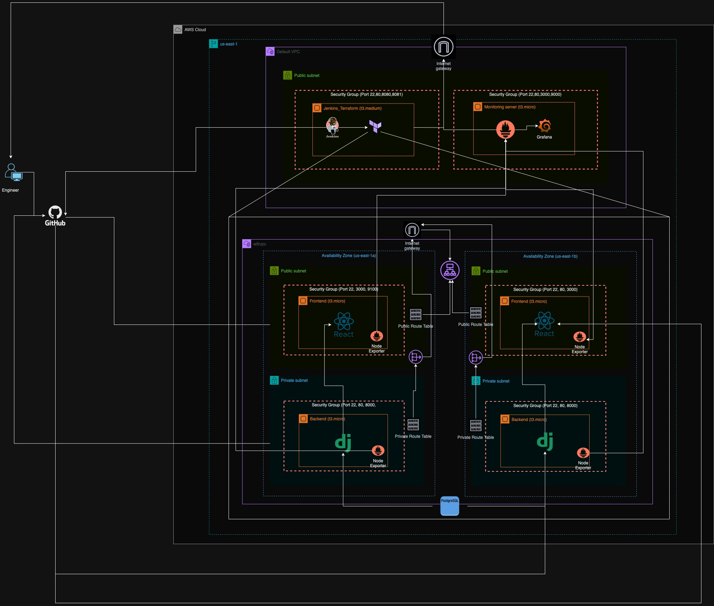

# Kura Labs Cohort 5 - Deployment Workload 5

## Infrastructure as Code and CI/CD Pipeline Deployment

Welcome to Deployment Workload 5! This workload builds on Workload 4 by further optimizing our infrastructure for security, reliability, and scalability. We are creating and deploying an e-commerce application infrastructure using Terraform and a Jenkins CI/CD pipeline to automate the deployment process.

---

## Purpose

The primary purpose of this workload is to gain experience in using Infrastructure as Code (IaC) with Terraform to deploy a scalable, secure e-commerce infrastructure and integrate it with a Jenkins CI/CD pipeline. By the end of this workload, we will have an automated deployment that includes a front-end, back-end, load balancer, and database, all set up within an AWS environment.

---

## Steps

### Step 1: Manual Deployment of Frontend and Backend EC2 Instances
Before automating, I manually deployed the application to two EC2 instances to understand the deployment process and dependencies. This involved:
- **Frontend Setup:** Cloning the repository to an EC2 instance, installing Node.js, configuring the proxy to communicate with the backend, and running the frontend on port 3000.
- **Backend Setup:** Cloning the repository, setting up a Python virtual environment, installing Django dependencies, updating `ALLOWED_HOSTS` in `settings.py` to the backend IP, and running Django on port 8000.

**Reasoning:** This manual setup provided a foundational understanding of the application's dependencies and configuration requirements, which is crucial when automating with a CI/CD pipeline.

### Step 2: Destroying Initial EC2 Instances
After confirming the setup, I terminated the initial EC2 instances. This was to ensure no lingering resources were left and to reduce AWS costs.

### Step 3: IaC and Terraform for Infrastructure Provisioning
With a clear understanding of the application, I transitioned to Infrastructure as Code using Terraform. The Terraform configuration includes:
- **VPC and Subnets:** A custom VPC with private and public subnets across two availability zones for high availability.
- **EC2 Instances for Frontend and Backend:** Four EC2 instances across the subnets to host the frontend and backend components.
- **Load Balancer:** A load balancer to distribute incoming traffic to the frontend instances.
- **RDS Database:** A PostgreSQL database configured through Terraform, along with security groups to control access.

**Reasoning:** Using Terraform for provisioning allows us to create, modify, and delete infrastructure consistently and efficiently. The distributed architecture enhances availability, and segregating components across private and public subnets increases security.

### Step 4: Setting Up Jenkins for CI/CD Pipeline
I created an EC2 instance named "Jenkins_Terraform" to host Jenkins, allowing for continuous integration and deployment. The Jenkinsfile was configured with the following stages:
- **Build:** Compiles and builds the application to ensure all dependencies are met.
- **Test:** Runs application tests to validate functionality.
- **Init, Plan, Apply:** Executes Terraform commands to initialize, plan, and apply infrastructure configurations, provisioning the environment.

**Reasoning:** A CI/CD pipeline with Jenkins automates deployment, ensuring consistency, reducing manual errors, and allowing for continuous application updates.

### Step 5: User Data Scripts for Automated EC2 Configuration
User data scripts were added to each EC2 instance to automate the setup of frontend and backend components upon instance creation. This includes commands to install dependencies, configure environment variables, and run the services.

**Reasoning:** Automating instance configuration streamlines deployment, reduces setup time, and ensures consistency.

### Step 6: Database Configuration and Data Migration
To connect the backend to the RDS database, I configured the database settings in `settings.py` and ran Django commands to create tables and migrate data from SQLite to PostgreSQL.

**Reasoning:** This step transitions the backend to use a managed database, which improves scalability and reliability.

### Step 7: Monitoring Instance for Resource Tracking
A separate EC2 instance was created for monitoring, utilizing tools like Node Exporter to track the resource usage of each server in real time.

**Reasoning:** Monitoring is essential for detecting potential issues early and optimizing resource allocation.

---

## System Design Diagram



*The diagram illustrates the e-commerce application's architecture, including the VPC, subnets, EC2 instances for frontend and backend, load balancer, RDS database, and monitoring setup.*

---

## Issues/Troubleshooting

1. **Backend Connection to RDS:** Initially, there was a timeout error when connecting the backend to the RDS instance. This was resolved by configuring the RDS security group to allow inbound connections from the backend EC2 instances.
   
2. **Jenkins IAM Credential Management:** I encountered issues with securely passing AWS credentials to Terraform in Jenkins. This was resolved by storing the credentials in Jenkins' Secret Manager and referencing them in the pipeline.

3. **High CPU Usage on EC2 Instances:** During testing, high CPU usage on the backend EC2 instance caused pipeline failures. Increasing the instance type to t3.medium resolved this issue.

4. **Automated IP Configuration in Scripts:** Ensuring the backend and frontend could communicate automatically required outputting private IPs through Terraform and passing them to user data scripts. This took trial and error to implement correctly.

---

## Optimization

- **Automated Backend-Frontend Connection:** Currently, connecting the backend and frontend requires manual IP input in configuration files. This could be optimized by automating IP retrieval and replacement in the pipeline, possibly with dynamic DNS or additional automation within Terraform.
  
- **Using Managed Services:** To further streamline infrastructure management, services like AWS ECS for container orchestration and RDS Proxy could be leveraged to improve scalability and manageability.
  
- **Database Caching:** Implementing caching with services like Redis could improve database performance by reducing load on the RDS instance.

---

## Business Intelligence

1. **Schema Diagram:** (See draw.io schema diagram in the repository)
   
2. **Data Rows Count:** The SQL queries used were:
   ```sql
   SELECT COUNT(*) FROM auth_user;
   SELECT COUNT(*) FROM product;
   SELECT COUNT(*) FROM account_ordermodel;
   ```
3. **Top and Bottom States by Orders:** The following query identifies states with the most and fewest orders:
   ```sql
   SELECT state, COUNT(*) as order_count 
   FROM account_ordermodel 
   GROUP BY state 
   ORDER BY order_count DESC 
   LIMIT 5;
   ```
4. **Top Product by Sales:** The top 3 products sold were identified with:
   ```sql
   SELECT product_id, COUNT(*) as sales_count 
   FROM account_ordermodel 
   GROUP BY product_id 
   ORDER BY sales_count DESC 
   LIMIT 3;
   ```

## Conclusion

Deployment Workload 5 was a comprehensive exercise in using Infrastructure as Code, CI/CD, and cloud resources to deploy an e-commerce application. It reinforced key DevOps concepts, including the importance of documentation, automation, and monitoring. This workload not only enhanced my technical skills in Terraform, Jenkins, and AWS but also deepened my understanding of deploying scalable and secure applications in a cloud environment. I’m looking forward to applying these skills in real-world scenarios and exploring further optimizations in cloud infrastructure deployment.
